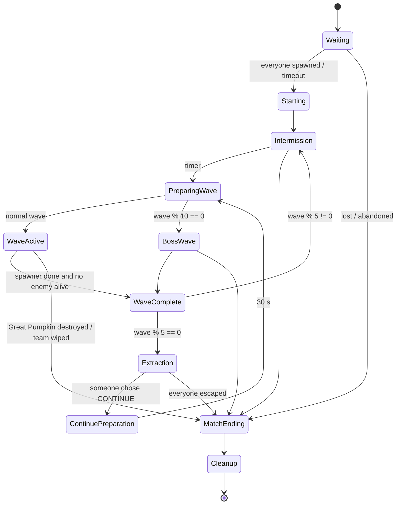

# Architecture

This is the engineering reference for Protect the Pumpkin Farm. Module names, remote names,
attribute names and method signatures here match the code exactly; `tests/static_check.py`
enforces the cross-references (service calls, requires, remotes, effects).

## 1. Principles

| Principle | How it is enforced |
|---|---|
| **Server-authoritative** | Health, damage, currencies, crops, stock, chest, decisions and rewards live only on the server. Clients get read-only attributes and snapshots. |
| **Remotes carry intent** | `RequestAttack(aimPoint, sequence)`, never `(enemy, damage)`. Every client→server remote has a schema, a rate limit and a server handler that re-checks game state. |
| **Configuration-first** | All tuning lives in `ReplicatedStorage.Shared.Config.*` (deep-frozen at load). No gameplay numbers are hard-coded in services. |
| **Isolated match state** | All per-match state hangs off a `Match` object or is keyed by it inside a service (`states[match]`). Several matches run in one server without sharing anything. |
| **No require cycles** | Services find each other through `Server.Registry` at call time. Bootstrap is the only place that requires services. |
| **Everything is owned** | Every match, enemy, crop, defense, weapon, character and client binding has a `Janitor`. Teardown is one call. |
| **Fail safe** | Each service's Init/Start, each remote handler, each AI agent, each match update and each effect renderer runs in `pcall`/`xpcall`. One failure is reported and isolated. |

## 2. Studio tree

The code tree comes from `default.project.json`; everything else is created at runtime by the scripts listed.

```
ReplicatedStorage
├── Shared                                  (src/shared)
│   ├── Config        CropConfig SeedConfig EnemyConfig WaveConfig ClassConfig WeaponConfig
│   │                 DefenseConfig EconomyConfig StatusEffectConfig DifficultyConfig MatchConfig
│   │                 NetworkConfig AudioConfig
│   ├── Constants     MatchState ResultCode Attributes LifeState CollisionGroup CurrencyId
│   ├── Types         Types
│   ├── Utilities     TableUtil Validate WeightedRandom Format MathUtil Result Clock
│   ├── Data          Rarity Palette
│   └── Classes       Janitor Signal StateMachine TokenBucket
├── Remotes                                 (created by RemoteService:Init from NetworkConfig)
└── Assets            Enemies Crops Weapons UI Effects   (optional art overrides, see §2.2)

ServerScriptService
└── Server                                  (src/server)
    ├── Bootstrap        (Script)           the only server script
    ├── Registry         service locator
    ├── DebugConfig
    ├── Services         29 singleton services (see §3)
    ├── Systems          RemoteRateLimiter CollisionGroups ModelFactory MapBuilder ProjectileSystem
    │                    AIScheduler WaveComposer WaveSpawner
    ├── AI               EnemyBase ZombieFarmer ZombieMole BlightedScarecrow PlagueCrow Witch
    │                    CursedHarvester Navigator PathQueue TargetSelector MoverRig UndergroundRouter
    ├── Classes          Match PlayerSession FarmCore Crop SeedShop HarvestChest EscapeDoor
    │                    Defense Barricade Sentry  Weapons/{Weapon MagicStaff ReaperScythe}
    └── Data             DataConfig ProfileTemplate Migrations SessionLockedStore ProfileServiceWrapper

ServerStorage
├── Packages            (optional) ProfileService ModuleScript
└── Maps                (optional) FarmArena Model

StarterPlayer.StarterPlayerScripts
└── Client                                  (src/client)
    ├── ClientBootstrap  (LocalScript)      the only client script
    ├── Modules          Net ControllerRegistry ClientState UIKit Panels
    └── Controllers      14 controllers (see §3.3)
```

**Deviation from the brief: UI lives in code, not in StarterGui.** Each controller builds its
ScreenGui (`MainHUD`, `ShopUI`, `HarvestUI`, `EscapeUI`, `ClassUI`, `BossUI`, plus `LobbyUI`,
`UpgradeUI`, `DefenseUI`, `BannerUI`, `CombatUI`, `NotificationUI`, `EffectsUI`) in `PlayerGui` with
`ResetOnSpawn = false`. This keeps the UI diffable, guarantees that every element a controller
uses exists, and needs no binary assets. The ScreenGui names match the brief.

### 2.1 Runtime object contract

| Object | Class | Parent | Attributes / children | Created by | Consumed by |
|---|---|---|---|---|---|
| `Remotes.<Name>` | RemoteEvent / RemoteFunction | ReplicatedStorage.Remotes | — | RemoteService:Init | client `Net` |
| `Lobby` | Folder | Workspace | floor, walls, decor | LobbyService:Init → MapBuilder.BuildLobby | — |
| `Lobby.LobbySpawn` | SpawnLocation | Lobby | Neutral, Duration 0 | MapBuilder | Player:LoadCharacter |
| `Lobby.FarmPortal…JoinQueuePrompt` | ProximityPrompt | FarmPortal.Portal | — | MapBuilder | LobbyService (Triggered → JoinQueue/LeaveQueue) |
| `Lobby.Wardrobe.WardrobePrompt` | ProximityPrompt | Wardrobe | `OpensUI = "ClassUI"` | MapBuilder | client Panels |
| `Lobby.UpgradeStand.UpgradesPrompt` | ProximityPrompt | UpgradeStand | `OpensUI = "UpgradeUI"` | MapBuilder | client Panels |
| `Matches` | Folder | Workspace | — | Match.new | ClientState |
| `Match_<id>` | Folder | Workspace.Matches | MatchId, State, Wave, IsBossWave, EnemiesRemaining, PhaseEndsAt, ContinueLevel, DifficultyMultiplier, CoreHealth, CoreMaxHealth, ChestValue, Objective, BossActive, BossName, BossHealth, BossMaxHealth, BossAuraRadius, BossEnraged | Match / WaveService / FarmCore / HarvestChestService / CursedHarvester | HUD, WaveUI, BossBar, EscapeUI |
| `Match_<id>.Map.Ground` | Folder | Map | floor/soil/plots (`Diggable = true`), rocks / foundation / chest pad (`NoDig = true`) | MapBuilder | UndergroundRouter, DefenseService, PlagueCrow, BlightedScarecrow |
| `Map.Ground.Plot<n>` | Part | Ground | `Diggable`, `PlotId` | MapBuilder | CropService (via layout), DefenseService |
| `Map.Props.Slot<n>` | Part | Props | `PlotId`, `SlotIndex` | MapBuilder | CropController (local Plant prompts) |
| `Match_<id>.GreatPumpkin` | Model | match folder | — | FarmCore | TargetSelector (object), DefenseShopController (placement hint) |
| `Match_<id>.HarvestChest` | Model | match folder | `Base.ChestPrompt` with `OpensUI = "HarvestUI"` | HarvestChestService | client Panels |
| `Match_<id>.EscapeDoor` | Model | match folder | `Portal.EscapeAnchor.EscapePrompt`, `Portal.ContinueAnchor.ContinuePrompt` | EscapeDoor | EscapeService |
| `Crops.Crop_<uid>` | Model | match `Crops` | CropUid, CropId, PlotId, SlotIndex, Stage, Growth, Health, MaxHealth, Ripe, MatchId; `Anchor` (PrimaryPart); `Visual` | Crop | CropController |
| `Enemies.<EnemyId>` | Model | match `Enemies` | EnemyUid, EnemyId, Health, MaxHealth, Underground, MatchId; `HumanoidRootPart` (+ `Humanoid` for walkers) | EnemyBase | EffectsController (health bars), WeaponController (touch aim) |
| `Defenses.<DefenseId>_<n>` | Model | match `Defenses` | DefenseUid, DefenseId, Health, MaxHealth, Level, MatchId; barricade `Base` has a `PathfindingModifier` (Label `Barricade`, PassThrough) | Defense / Barricade / Sentry | DefenseShopController, Navigator |
| Player attributes | — | Player | Candies, MatchCoins, ClassId, MatchId, LifeState, ProfileStatus, Effects (JSON), Queued, QueueEndsAt, QueueSize | DataService, MatchCoinService, ClassService, Match, PlayerSession, StatusEffectService, LobbyService | client |
| Class weapon | Tool | Backpack → Character | `WeaponId`, `AbilityId` | WeaponService | WeaponController |
| `ClientEffects` | Folder (client only) | Workspace | — | EffectsController | — |
| `PumpkinFarmDebug` | TextChatCommand | TextChatService | — | DebugService (if enabled) | — |

### 2.2 Swappable art assets

Every builder in `ModelFactory` first looks for an asset and falls back to a procedural model:

| Asset | Requirements |
|---|---|
| `ReplicatedStorage.Assets.Enemies.<EnemyId>` | Model, PrimaryPart `HumanoidRootPart`; walkers need a `Humanoid` with HipHeight set (crows must not have one) |
| `ReplicatedStorage.Assets.Crops.<CropId>` | Model at ripe size with PrimaryPart on the soil line (scaled down per stage) |
| `ReplicatedStorage.Assets.Weapons.<WeaponId>` | Tool with a `Handle` |
| `ReplicatedStorage.Assets.Defenses.<DefenseId>` | Model, PrimaryPart `Base`; sentries may have a `Head` part that turns to aim |
| `ReplicatedStorage.Assets.Effects.<EffectName>` | ParticleEmitter, emitted in addition to the procedural effect |
| `ServerStorage.Maps.FarmArena` | Model with a `Ground` folder (`Diggable` floor parts, `NoDig` obstacles); plots and slots are still generated |
| `ServerStorage.Packages.ProfileService` | loleris' ProfileService ModuleScript; replaces the built-in session-locked store |
| `AudioConfig` sound ids | swap in uploaded sounds; empty ids are skipped |

## 3. Services, systems and classes

### 3.1 Server services (`ServerScriptService.Server.Services`)

Each service is a table with optional `Init()` (wiring only) and `Start()` (connect events, start
loops). Services marked **M** hold per-match state and implement `InitMatch(match)` /
`CleanupMatch(match)`.

| Service | M | Responsibility | Key API |
|---|---|---|---|
| RemoteService | | creates all remotes; guard pipeline (rate limit → schema → pcall); security metrics | `OnEvent`, `OnInvoke`, `FireClient(s)`, `FireAllClients`, `ReportViolation`, `VerifyHandlers` |
| DataService | | profiles: load/migrate/reconcile/release, transactional `Update`, replication, autosave, shutdown | `LoadProfileAsync`, `ReleaseProfile`, `IsLoaded`, `GetData`, `Update`, `GetCandies`, `AddCandies`, `SpendCandies`, `OwnsCostume`, `UnlockCostume`, `SetEquippedCostume`, `GetSeedCount`, `AddSeeds`, `ConsumeSeed`, `GetUpgradeLevel`, `SetUpgradeLevel`, `IncrementStatistic`, `RecordHighestWave`, `RecordClassMatch`, `SetSetting`, `GetProfileView`, `RequestSave` |
| CandyService | | permanent currency, validated grants/spends | `Get`, `Add`, `TrySpend`, `CanAfford` |
| MatchCoinService | | temporary per-match currency (memory only) | `Reset`, `Clear`, `Get`, `Add`, `TrySpend`, `CanAfford` |
| CurrencyService | | single façade over both currencies | `Get`, `CanAfford`, `TrySpend`, `Grant` |
| DifficultyService | | every difficulty formula (pure) | `GetWaveMultiplier`, `GetContinueFactor`, `GetEnemyStats`, `GetEnemyCount`, `GetSpawnInterval`, `GetBurstSize`, `GetSpecialShare`, `GetSpecialWeightMultiplier`, `IsBossWave`, `GetBossIndex`, `GetDangerMultiplier` |
| StatusEffectService | | timed effects with stacking rules + immunity, for players and enemies | `Apply`, `Remove`, `Has`, `ClearTarget`, `GetSpeedMultiplier`, `GetAttackSpeedMultiplier`, `GetDamageTakenMultiplier`, `BlocksAttacks`, `BlocksJump` |
| StunService | | non-stacking stuns + anti-movement while stunned | `TryStun`, `IsStunned` |
| EffectService | | cosmetic events to clients in the same match (distance-culled) | `Play`, `PlayAt`, `PlayFor` |
| DamageService | | the only damage path | `DamageEnemy`, `DamagePlayer`, `DamageTarget`, `DamageEnemiesInRadius` |
| RewardService | | deterministic rewards + once-per-match stat commit | `OnEnemyKilled`, `OnWaveCompleted`, `OnBossKilled`, `OnCropHarvested`, `OnStolenCropRecovered`, `CommitMatchStats` |
| UpgradeService | | permanent Candy upgrades | `GetLevel`, `Purchase`, `GetStartingCoinBonus`, `GetGrowthSpeedMultiplier` |
| ClassService | | class ownership, selection, purchase, costume/stat application | `InitializePlayer`, `ApplyToCharacter`, `SelectClass`, `PurchaseClass` |
| WeaponService | | gives class weapons; validates attack/ability intent | `EquipWeapon`, `UnequipWeapon`, `HandleAttack`, `HandleAbility` |
| SeedService | | persistent seed pouch, soft-lock grant | `GetSeedCount`, `GetTotalSeeds`, `AddSeeds`, `ConsumeSeed`, `GrantSoftLockIfNeeded` |
| CropService | M | planting/harvest validation, growth tick, damage, theft | `Plant`, `Harvest`, `GetCrops`, `GetCrop`, `GetCropsInRadius`, `DestroyCrop`, `StealCrop`, `HealAll`, `ForceRipenAll`, `.CropRemoved` |
| SeedShopService | M | randomized stock per intermission, atomic purchases | `Restock`, `SetOpen`, `IsOpen`, `Purchase`, `GetSnapshot` |
| HarvestChestService | M | team chest, payout formula, replication | `Deposit`, `GetTotalValue`, `GetRiskBonus`, `ComputePayout`, `Forfeit`, `GetSnapshot` |
| BarricadeService | M | barricade registry | `Create`, `Remove`, `GetBarricades` |
| SentryService | M | sentry registry + one 10 Hz loop | `Create`, `Remove`, `GetSentries` |
| DefenseService | M | buying, placement validation, upgrades, items, unified defense queries | `PurchaseDefense`, `UpgradeDefense`, `PurchaseItem`, `ValidatePlacement`, `GetDefenses`, `GetDefense`, `GetDefenseFromPart`, `GetDefensesInRadius`, `DestroyDefense`, `RepairAll` |
| EnemyService | M | enemy factory/registry, AI scheduler, spatial queries, router cache, orphan sweep | `SpawnEnemy`, `GetEnemies`, `GetAliveCount`, `GetEnemiesInRadius`, `GetNearestEnemy`, `GetUndergroundRouter`, `DespawnAll`, `KillAll`, `SweepOrphans`, `.EnemyRemoved` |
| WaveService | M | per-match wave orchestration | `PrepareWave`, `StartWave`, `Update`, `IsWaveCleared`, `GetRemaining`, `StopWave`, `ForceComplete` |
| EscapeService | M | door, decisions, payouts, resolution | `OpenDoor`, `CloseDoor`, `SubmitDecision`, `Update`, `GetSnapshot` |
| CleanupService | | ordered match teardown + periodic orphan sweep | `CleanupMatch`, `Sweep` |
| MatchService | | arena slots, match creation, central match loop, removal/return to lobby | `CanCreateMatch`, `CreateMatch`, `GetMatch`, `GetMatches`, `GetMatchForPlayer`, `RemoveSession`, `OnPlayerRemoving`, `DestroyMatch` |
| LobbyService | | lobby world, matchmaking queue | `GetSpawnCFrame`, `JoinQueue`, `LeaveQueue` |
| PlayerService | | sessions, spawning, death, leave, snapshots, settings | `GetSession`, `GetSessions`, `SpawnAsync`, `SpawnInLobby`, `SpawnInMatch`, `Notify`, `GetSnapshot` |
| DebugService | | gated test commands | chat `/pf …` |

**Bootstrap order** (Init, then Start, both in this order): RemoteService, DataService,
CandyService, MatchCoinService, CurrencyService, DifficultyService, StatusEffectService,
StunService, EffectService, DamageService, RewardService, UpgradeService, ClassService,
WeaponService, SeedService, CropService, SeedShopService, HarvestChestService, BarricadeService,
SentryService, DefenseService, EnemyService, WaveService, EscapeService, CleanupService,
MatchService, LobbyService, PlayerService, DebugService. Then `RemoteService:VerifyHandlers()`.
RemoteService goes first because clients wait for its remotes. LobbyService builds the lobby in
Init. PlayerService starts last so a joining player only touches services that are ready.

**Per-match order** (`MatchService.MatchServices`): CropService, SeedShopService,
HarvestChestService, BarricadeService, SentryService, DefenseService, EnemyService, WaveService,
EscapeService. `InitMatch` runs in this order and `CleanupMatch` in reverse, so enemies are gone
before the crops and defenses they target.

### 3.2 Runtime classes

| Class | Created by | Notes |
|---|---|---|
| `Match` | MatchService | owns folder, arena layout, FarmCore, StateMachine, sessions, seeded `Rng` |
| `PlayerSession` | PlayerService | life state, class, character refs, match accessories/cooldowns/stats; damageable target |
| `FarmCore` | Match | the Great Pumpkin; destroyed → match lost |
| `Crop` | CropService | growth, stages, health, specials (Thorns/Decoy/Anchored/Regenerate) |
| `SeedShop` | SeedShopService | pure stock generation + Check/Commit purchase |
| `HarvestChest` | HarvestChestService | pure ledger: deposit, total, payout, forfeit |
| `EscapeDoor` | EscapeService | model + two prompts |
| `Defense` → `Barricade`, `Sentry` | Barricade/SentryService | health, upgrades, repair; sentry targeting |
| `Weapon` → `MagicStaff`, `ReaperScythe` | WeaponService | server cooldowns, hit resolution, abilities |
| `EnemyBase` → `ZombieFarmer`, `ZombieMole`, `BlightedScarecrow`, `PlagueCrow`, `Witch`, `CursedHarvester` | EnemyService | see §5 |

### 3.3 Client (`StarterPlayerScripts.Client`)

`ClientBootstrap` waits for `game.Loaded`, runs `Init` on every controller (build UI), starts
`ClientState`, then runs `Start` (connect events) in this order: NotificationController,
AudioController, EffectsController, HUDController, WaveUIController, LobbyController,
ClassController, SeedShopController, CropController, HarvestChestController,
DefenseShopController, EscapeController, WeaponController, BossBarController.

| Module | Role |
|---|---|
| `Net` | remote lookup; `Invoke` never throws (returns a failed Result) |
| `ClientState` | read-only cache: Profile/Shop/Chest/Extraction + current match folder; `ObserveMatchAttribute` survives match changes |
| `UIKit` / `Panels` | UI builder with one visual language; mutually exclusive panels; `OpensUI` prompts |
| HUDController | wave/day, zombies left, phase timer, objective, Great Pumpkin bar, health, coins, candies, effects, action buttons |
| WaveUIController | wave/boss banners, PREPARATION 30…0 countdown with danger level, results card |
| LobbyController | PLAY/queue, settings toggles, stats, data-failure warning |
| ClassController | ClassUI (buy/equip costumes), UpgradeUI |
| SeedShopController | ShopUI + seed pouch selection |
| CropController | local Plant/Harvest prompts, crop billboards |
| HarvestChestController | HarvestUI + chest value chip |
| DefenseShopController | DefenseUI, placement ghost, upgrade prompts |
| EscapeController | EscapeUI (ESCAPE TO THE LOBBY / CONTINUE) |
| WeaponController | attack/ability intent, aim, ability cooldown button |
| BossBarController | BossUI |
| EffectsController | all cosmetic effects + enemy health bars |
| AudioController | sounds and music from AudioConfig, respects settings |
| NotificationController | toasts, Result → friendly message |

## 4. Match lifecycle



| State | On enter | Leaves when |
|---|---|---|
| Waiting | spawn every player at an arena spawn | all alive or 15 s |
| Starting | starting Match Coins (+Deep Pockets), soft-lock seed grant, first restock | 5 s |
| Intermission | restock (not the first), shop open | 40 s first / 25 s later |
| PreparingWave | `Wave += 1`, compose plan, banner | 4 s |
| WaveActive / BossWave | start spawner, shop closed | `IsWaveCleared` |
| WaveComplete | wave coins, revive downed players | 4 s |
| Extraction | door opens, 30 s decision window | resolution from EscapeService |
| ContinuePreparation | `ContinueLevel += 1`, heal players, repair defenses 35 %, heal core 25 %, heal crops, restock | 30 s |
| MatchEnding | stop wave, forfeit chest if lost, commit stats, results | 8 s or nobody left |
| Cleanup | return remaining players, tear everything down | — |

The shop is open in Starting, Intermission, WaveComplete and ContinuePreparation
(`MatchConfig.SeedShopOpenStates`). Planting, harvesting and building are allowed in every state
except Waiting, MatchEnding and Cleanup.

**Losing.** The match is lost if the Great Pumpkin is destroyed, or if every player is down during a
wave. The chest is forfeited, statistics are committed, and players return to the lobby.
Players knocked out during a wave are revived at WaveComplete. Outside waves they come back after 3 s.

## 5. AI

- **AIScheduler**: one Heartbeat for every enemy. Each agent has its own think rate (0.1–0.25 s),
  random phase, and a per-frame budget of 40 updates. Errors remove only the faulty agent.
- **PathQueue**: at most 6 concurrent `Path:ComputeAsync`. Requests from dead agents are skipped.
- **Navigator**: walks directly when the goal is close and in line of sight. Otherwise it re-paths
  only when the goal moves more than 8 studs, the agent is stuck, or the path is used up (at most
  once per 1.5 s). It accepts `ClosestNoPath` waypoints. Barricade `PathfindingModifier`s cost 25,
  so enemies prefer an open gate and attack the barricade when every gate is sealed
  (`GetBlockingDefense`).
- **TargetSelector**: `score = priority × (1 + decoy bonus) / (1 + distance / 40)`. It uses the
  match registries, not workspace scans. Players count only inside DetectionRange and are dropped
  beyond LeashRange. A 30 % hysteresis stops target flip-flopping. `GetApproachPoint` puts the goal
  just outside solid targets.
- **Network ownership** of every NPC root is forced to the server.

| Enemy | Movement | Behaviour |
|---|---|---|
| Zombie Farmer (Grunt) / Zombie Sprout | Humanoid + Navigator | crops > players in aggro > sentries > core; attacks blocking defenses |
| Zombie Mole (Breacher) | Humanoid + MoverRig underground | StateMachine `Idle → SelectingTarget → EnteringUnderground → UndergroundTraversal → Resurfacing → AttackingCrop → Retargeting`, plus `Combat` and `Dying` (below) |
| Blighted Scarecrow (Leaper) | Humanoid + ballistic leap | StateMachine `Chasing → LeapWindup → Leaping → Landing`. Leaps when a barricade blocks the way or the target is 10–38 studs away. The landing spot is checked with a ground raycast and telegraphed. Landing damages and stuns for 2 s (StunService). |
| Plague Crow (Air) | MoverRig (AlignPosition) | StateMachine `Retargeting → Cruising → Diving → Stealing → Escaping`. Keeps altitude with a ground raycast and climbs over obstacles found by a forward raycast. Steals a crop and flies to the nearest edge. Pecks Anchored crops and the core. Shooting it down returns a ripe crop to the chest. |
| Witch (Spawner) | Humanoid + Navigator | holds a 24–44 stud band from the nearest player and separates from other witches. Throws ballistic slowing potions (ProjectileSystem, gravity, target lead). Summons 2 Sprouts every 12 s, up to 4 alive. |
| Cursed Harvester (Boss) | Humanoid + Navigator | 3 s anchored intro, then hunts defenses within 70 studs, then crops, then the core. Crushes barricades within 11 studs instantly. Sweep attack every 5 s. Aura pulse every 0.5 s (`BossAura`: speed ×1.35, attack speed ×1.2) within 35 studs. Enrages below 30 %. Drives the boss HUD attributes. |

**Mole underground traversal.** `UndergroundRouter.ForArena` makes a 4-stud grid over the arena
bounds. A cell is diggable if a downward raycast against `Map/Ground` hits a part with
`Diggable = true` and without `NoDig` (rocks are bedrock; the core foundation and chest pad are
protected). Probing is lazy and cached per match. A* uses octile distance, bans corner-cutting
between bedrock cells, and is bounded by `MaxRouteExpansions`. The route is then string-pulled
with a check that treats the tunnel as nearly one cell wide. Fences and barricades are not in
`Ground`, so tunnels pass under the outer defenses. The resurface point is a diggable cell 3.5–7.5
studs from the crop that is clear of defenses (box query). While buried, the mole is
Ghost-collided and invisible, has a dirt mound welded above it, cannot be hit by melee or
sentries, and takes ×0.5 damage from area magic. A mole that cannot tunnel (target surrounded by
bedrock) fights on the surface. On death it is reset to a visible surface state.

## 6. Difficulty

Implemented in `DifficultyService`, tuned in `DifficultyConfig`:

```
waveMult(curve, w) = min(Max, Growth^(Exponent × (min(w, SoftCap) − 1)) × PostGrowth^(max(0, w − SoftCap)))

ScaledHealth = BaseHealth × (1 + (waveMult(Health) − 1) × Enemy.Scaling.Health)
             × (1 + 0.35 × (players − 1)) × ContinueFactor(Health | BossHealth) × bossIndexBonus
ScaledSpeed  = BaseSpeed × (1 + (waveMult(Speed) − 1) × Enemy.Scaling.Speed) × ContinueFactor(Speed)
ScaledDamage = Damage × waveMult(Damage) × ContinueFactor(Damage)

ContinueFactor(stat, L) = 1 + (1.5^L − 1) × Weight[stat]
   Weights: Health 1, BossHealth 1, Damage 0.5, Density 0.6, SpawnPressure 0.5, Speed 0.3
```

| Curve | Growth | Exponent | Soft cap | After cap | Max |
|---|---|---|---|---|---|
| Health | 1.2 | 1 | wave 15 | ×1.05 / wave | ×40 |
| Speed | 1.2 | 0.15 | wave 25 | — | ×1.6 |
| Damage | 1.2 | 0.35 | wave 20 | ×1.01 / wave | ×4 |

Wave composition (WaveComposer): enemy count `(6 + 2.5(w−1)) × 1.035^(w−1)` × player density ×
continue density, capped at 140. A growing share of the wave is specialists, picked by weight
among unlocked archetypes and capped by MaxShare / MaxPerWave. The Continue level multiplies
specialist weights. Witches spawn after the first 30 % of the wave. On boss waves the Harvester
spawns first and the escort is half size. At most 45 enemies are alive at once.

## 7. Economy

| Flow | Rule |
|---|---|
| Match Coins in | 150 at start (+25 / Deep Pockets level), kills (base × (1 + 5 %/wave) × Lucky Charm; assists 40 % when ≥ 10 % damage dealt), wave clear (40 + 8 × wave), boss kill (400 each) |
| Match Coins out | barricades, sentries, upgrades, accessories, utilities |
| Candies in | extraction only: `floor(chest value × 1.0 × (1 + 0.25 × ContinueLevel))` to every escaping player |
| Candies out | seeds (shop price), classes, permanent upgrades |
| Chest in | harvests (yield × unit value), Cursed Core on boss kill (500 + 250 × ContinueLevel), stolen ripe crops recovered from crows |
| Soft lock | a player with no seeds and fewer Candies than the cheapest seed gets 2 Neon Star-Fruit seeds at match start |

Seeds are persistent (`profile.Seeds`): they are bought with permanent Candies, so unplanted seeds
are never lost.

## 8. Networking

### 8.1 Pipeline (every client→server call)

1. The sender must still be in the game.
2. Token bucket per (player, remote). Over the limit → dropped (events) or `RateLimited`
   (functions), and a security violation is recorded.
3. Argument count and schema (`Validate.CheckArgs`): strings have a length limit and a
   `[%w_]` pattern, numbers must be finite and in range, Vector3s finite with a magnitude limit,
   enums whitelisted, no extra arguments. Bad payloads are rejected with `InvalidPayload` and
   counted.
4. The handler runs in `xpcall`. An error becomes `ServerError`. A non-Result return value becomes
   `ServerError`.
5. 40 violations in 30 s log a security warning (`NetworkConfig.Security`; optional kick).

RemoteFunctions are only ever invoked by clients. The server never invokes a client.

### 8.2 Remote table

| Name | Class | Dir | Payload | Server validation (besides §8.1) | Rate limit (burst / refill per s) | Response | Failure codes |
|---|---|---|---|---|---|---|---|
| RequestJoinQueue | RF | C→S | — | session, profile loaded, not in a match, LifeState Lobby, not queued | 3 / 0.5 | `{QueueSize, StartsAt}` | DataNotLoaded, AlreadyInMatch, AlreadyDone, InvalidState |
| RequestLeaveQueue | RF | C→S | — | is queued | 3 / 0.5 | `{}` | NotFound |
| RequestSelectClass | RF | C→S | `classId` | profile loaded, class exists, Lobby/Queued, **owned per profile** | 4 / 1 | `{ClassId}` | DataNotLoaded, NotFound, InvalidState, NotOwned |
| RequestPurchaseClass | RF | C→S | `classId` | profile loaded; ownership + price + charge in ONE profile mutation | 3 / 0.5 | `{ClassId}` | NotFound, DataNotLoaded, AlreadyOwned, InsufficientFunds |
| RequestPurchaseUpgrade | RF | C→S | `upgradeId` | profile loaded; next level + cost + charge in one mutation | 3 / 0.5 | `{Level}` | NotFound, DataNotLoaded, MaxLevel, InsufficientFunds |
| RequestUpdateSettings | RE | C→S | `key` ∈ {MusicEnabled, EffectsEnabled}, `value: boolean` | key exists and is boolean in profile | 4 / 1 | `ProfileUpdated` | ignored |
| RequestSnapshot | RF | C→S | — | — | 3 / 0.5 | `{Profile, Shop, Chest, Extraction}` | — |
| RequestBuySeed | RF | C→S | `seedId`, `stockVersion: int` | in match, profile loaded, shop open, version matches, stock > 0, per-player limit; Candies charge + seed grant in one mutation; stock decrement with no yield in between | 6 / 3 | `{SeedId, Remaining}` | NotInMatch, DataNotLoaded, InvalidState, StockChanged, NotFound, OutOfStock, PurchaseLimit, InsufficientFunds |
| RequestPlant | RF | C→S | `plotId`, `slotIndex: 1..64`, `seedId` | in match, alive, not ending; plot/slot exist in **this** farm; slot empty; within PlantRange (14); slot not obstructed (box query on Defenses); seed owned and consumed atomically | 6 / 3 | `{CropUid}` | NotInMatch, InvalidState, Dead, NotFound, Occupied, OutOfRange, Blocked, NotOwned |
| RequestHarvest | RF | C→S | `cropUid` | crop in **this** match, alive, ripe, within HarvestRange (14); crop removed before the reward | 8 / 4 | `{CropId, Quantity}` | NotInMatch, Dead, NotFound, NotReady, OutOfRange |
| RequestPurchaseDefense | RF | C→S | `defenseId`, `position: Vector3`, `rotationY: −360..360` | alive in match, build allowed, coins, `ValidatePlacement` (ring 14–95 studs, bounds, ≤ 45 studs from player, ground raycast on diggable floor, not a plot, footprint box clear, caps 30 / 8 sentries); refunded if construction fails | 4 / 2 | `{DefenseUid}` | InsufficientFunds, Blocked, OutOfRange, LimitReached, NotFound, ServerError |
| RequestUpgradeDefense | RF | C→S | `defenseUid` | alive in match; defense in **this** match; next level exists; within 45 studs; coins | 4 / 2 | `{Level}` | NotFound, MaxLevel, OutOfRange, InsufficientFunds |
| RequestPurchaseItem | RF | C→S | `itemId` | alive in match; accessory not owned; utility off cooldown and useful (not full HP / something damaged); coins | 4 / 2 | `{ItemId}` | NotFound, AlreadyOwned, Cooldown, AlreadyDone, InsufficientFunds |
| RequestAttack | RE | C→S | `aimPoint: Vector3`, `sequence: int` | InMatch and alive; not stunned; sequence strictly increasing; class weapon Tool equipped; aim within 400 studs (else violation); server cooldown (0.12 s tolerance). Damage, targets and rewards are computed by the server. | 5 / 3 | effects | silently dropped |
| RequestUseAbility | RE | C→S | `abilityId`, `aimPoint: Vector3` | as RequestAttack, plus abilityId == class ability and ability cooldown | 3 / 1 | effects | silently dropped |
| RequestEscape | RF | C→S | — | in match, door open, InMatch and alive, not already decided or paid, within DoorRange (18); payout happens once (Paid flag set before paying) | 3 / 0.5 | `{Decision}` | NotInMatch, InvalidState, Dead, AlreadyDone, OutOfRange |
| RequestContinue | RF | C→S | — | same as RequestEscape | 3 / 0.5 | `{Decision}` | same |
| ProfileUpdated | RE | S→C | ProfileView | — | — | — | — |
| ShopUpdated | RE | S→C | ShopSnapshot (with this player's purchase counts) | — | — | — | — |
| ChestUpdated | RE | S→C | ChestSnapshot | — | — | — | — |
| ExtractionUpdated | RE | S→C | ExtractionSnapshot (with this player's decision) | — | — | — | — |
| MatchEvent | RE | S→C | `(name, data)`: WaveIncoming, BossIncoming, WaveStarted, WaveCompleted, BossSpawned, BossDefeated, ShopRestocked, ExtractionOpened, ContinueStarted, Escaped, MatchEnded | — | — | — | — |
| Notify | RE | S→C | `{Text, Kind, Duration}` | — | — | — | — |
| Effect | RE | S→C | `(effectName, params)`: purely cosmetic, culled at 400 studs | — | — | — | — |

The door's ProximityPrompts (engine-validated distance) and the UI buttons both go through
`EscapeService.SubmitDecision`, so both paths have the same rules.

## 9. Security model

| Threat | Mitigation |
|---|---|
| Fake damage / kills | Clients send aim and sequence only. Weapons resolve hits on the server from server positions. Kills and rewards come from `EnemyBase.Die` → `EnemyService` → `RewardService`. |
| Attack spam / replay | rate limit, strictly increasing sequence, server weapon cooldowns |
| Fake currency | Match Coins are server memory only, Candies are profile only. Attributes are display mirrors. Every amount is validated as a positive integer. |
| Fake prices / stock | prices come from the server's stock. The client sends only a seed id and the stock version. |
| Purchase races / double clicks | check and mutate happen in one non-yielding call (`DataService:Update`, `SeedShop:CheckPurchase` + `CommitPurchase`). Tested by the "last seed race" spec. |
| Double extraction payout | `Paid[userId]` is set before paying, decisions are one per player, and the player is removed from the match right after. Tested. |
| Remote harvest / plant across the map | slots and crops are looked up in the caller's match only, with distance checks on server positions |
| Planting inside objects / outside farm | slot-based planting (no free positions) + box obstruction query |
| Defense placement exploits | ring, bounds, distance, ground raycast, footprint overlap, caps |
| Class ownership spoofing | ownership is read from the profile, never from the client |
| Stun escape via client WalkSpeed | StunService snaps the character back if it moves > 4 studs while stunned |
| NPC physics hijack | `SetNetworkOwner(nil)` on every enemy root (re-applied after physics changes) |
| Malformed payloads (NaN, huge vectors, wrong types, extra args) | schema validation + violation metrics |
| Data duplication across servers | session-locked profiles. A save after losing the lock is cancelled and the player is kicked. |
| Data from a newer build | the profile is refused (not overwritten) |

## 10. Persistence

`DataService` → `ProfileServiceWrapper` → one of:
1. **ProfileService** (if `ServerStorage.Packages.ProfileService` exists)
2. **SessionLockedStore** on DataStoreService (default in live servers)
3. **SessionLockedStore** in memory: Studio mock, unpublished place, or DataStores unavailable.
   Profiles are flagged temporary and the lobby shows "Test mode".

Record format (built-in store): `{ Data = <profile>, MetaData = { ActiveSession = {SessionId, PlaceId} | nil, LastUpdate, SessionLoadCount, FormatVersion } }`.

- **Load**: `UpdateAsync` takes the lock unless another fresh session holds it (fresh =
  `LastUpdate` newer than 600 s). It retries 8 × 5 s, then fails safely. Then `Migrations.Run` →
  `Reconcile` with the template → default classes added → `ProfileStatus` attribute.
- **Save**: `UpdateAsync` checks we still hold the lock. If not, the write is cancelled and the
  profile is released with `SessionStolen`, which kicks the player. Saves are serialized and
  coalesced per profile, retried with backoff, and skipped when the request budget is low.
- **Autosave** every 60 s refreshes the lock. **Release** on leave writes the final save and
  unlocks. **BindToClose** releases everything (25 s timeout).
- **Failure**: no profile means no queueing, no Candy grants, no purchases. The player stays in the
  lobby with an explanation.

Profile schema (`ProfileTemplate`, Version 1):

```lua
{
    Candies = 120,
    UnlockedCostumes = { Knight = true },        -- set
    EquippedCostume = nil,                       -- nil = ClassConfig.DefaultClassId
    Seeds = { NeonStarFruit = 3 },               -- persistent seed pouch
    ClassStats = { [classId] = { MatchesPlayed, Kills, HighestWave } },
    PermanentUpgrades = { [upgradeId] = level },
    Statistics = { TotalWaves, TotalKills, TotalHarvested, BossesDefeated, MatchesPlayed, MatchesEscaped, HighestWave },
    Settings = { MusicEnabled = true, EffectsEnabled = true },
    Version = 1,
}
```

Migrations: `Steps[n]` upgrades version n → n+1 before reconciliation. Version 0 (unversioned
data) converts legacy array-style `UnlockedCostumes` and a legacy `Candy` key. To change the
schema, bump `CurrentVersion` and `ProfileTemplate.Version`, add a step, and add a case to
`tests/specs/data_spec.luau`.

## 11. Performance safeguards

- One Heartbeat for all AI (budgeted), one for all projectiles, one 10 Hz loop for all matches,
  one 10 Hz loop for all sentries, one 0.5 s loop for all crops, and one 0.1 s sweep for all status
  effects. There are no per-entity Heartbeat connections on the server.
- Pathfinding: concurrency-limited queue, re-path thresholds, direct walking when possible, and
  the stuck detector only re-paths.
- Mole routing: cached raycast grid, A* expansion budget, string-pulled routes.
- Spatial queries iterate the match registries (≤ 45 enemies), never `workspace:GetDescendants()`.
- At most 45 enemies alive per match, and spawning waits below the cap.
- Projectiles are analytic (no physics parts on the server). Clients re-simulate them from one
  launch event.
- Replication: countdowns are one `PhaseEndsAt` timestamp, crop growth replicates in 1 % steps,
  effects are distance-culled, and profile replication is coalesced to one send per frame.

## 12. Memory safety and cleanup

- `Janitor` owns every connection, instance, thread and object. `Destroy` cleans in reverse order
  and cleans any task added later immediately.
- Enemy death: the scheduler entry is removed, status effects are cleared, the janitor is
  destroyed, and the corpse is handed to Debris after the model is detached.
- Match end: `CleanupService.CleanupMatch` runs every per-match service's `CleanupMatch` in
  reverse order (each isolated), then `match:Destroy()` removes the folder, map, core and state
  machine.
- Character janitor per spawn. Session janitor per player. Client match janitors are re-created
  per match binding.
- A 30 s orphan sweep removes match folders without a match, registered enemies whose model
  vanished, and unregistered enemy models.

## 13. Extending

| Add | Steps |
|---|---|
| Class | ClassConfig entry → WeaponConfig weapon + ability → (new weapon Kind) a module in `Classes/Weapons` implementing `PerformAttack` / `PerformAbility`. |
| Enemy | EnemyConfig entry (`Class` = AI module) → AI module inheriting `EnemyBase` implementing `Think` → WaveConfig archetype rule. |
| Crop | CropConfig entry (+ optional `Special`) → SeedConfig rule. |
| Defense | DefenseConfig entry (`Kind` Barricade or Sentry). |
| Remote | NetworkConfig entry (schema + rate limit) → `OnInvoke` / `OnEvent` in the owning service. `static_check.py` fails if the handler is missing. |
| Effect | `EffectService:PlayAt(match, "Name", …)` → `renderers.Name` in EffectsController. `static_check.py` fails if the renderer is missing. |

## 14. Multiple servers / places

The game runs lobby and matches in one place by default. A server hosts up to 4 isolated arenas,
which covers solo, 2-player, 4-player and private servers (everyone in a private server shares one
queue). To split lobby and matches into separate places, reserve a server for each queued group
in `LobbyService` (TeleportService:ReserveServer + TeleportAsync with the group in TeleportData).
In the match place, call `MatchService:CreateMatch(sessions)` when the group has joined, and
teleport back to the lobby place after `MatchService:RemoveSession`. Match code never assumes the
lobby is in the same server, and profiles are session-locked across servers.
